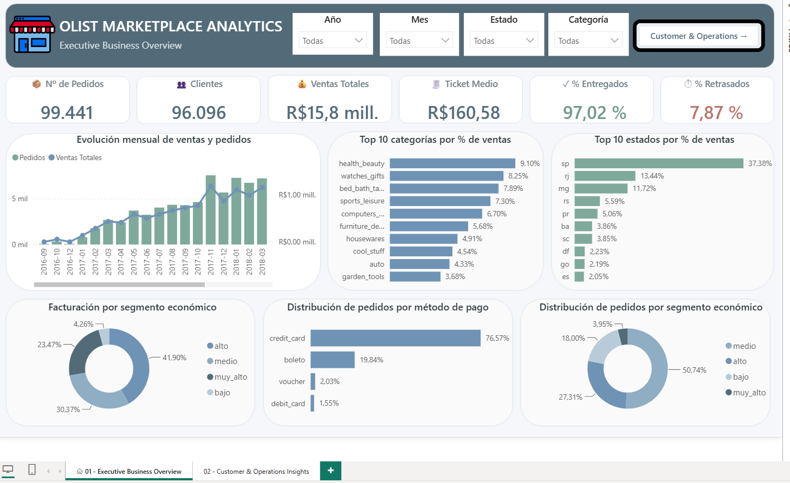
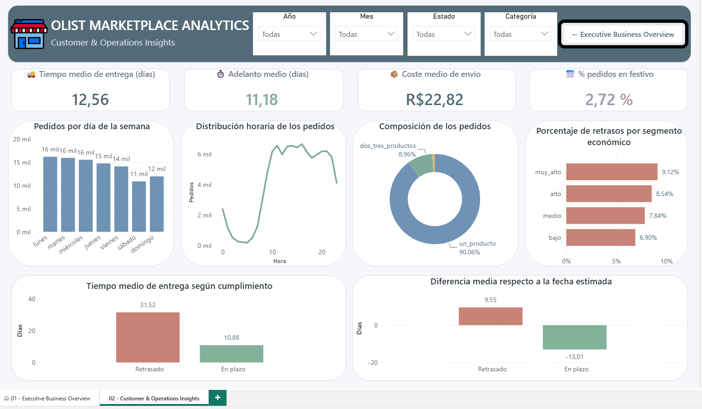

# Análisis Estratégico del Marketplace Brasileño Olist mediante Data Analytics


Proyecto Final de **Data Analytics** centrado en el análisis estratégico del marketplace brasileño **Olist**, combinando técnicas de preparación de datos, análisis exploratorio, análisis estadístico y Business Intelligence para transformar datos operativos en información útil para la toma de decisiones.

---

## Información general

| Característica | Descripción |
|----------------|-------------|
| **Tipo de proyecto** | Data Analytics & Business Intelligence |
| **Dataset principal** | Brazilian E-Commerce Public Dataset by Olist |
| **Periodo analizado** | 2016 - 2018 |
| **Lenguaje principal** | Python |
| **Visualización** | Power BI |
| **Público objetivo** | Dirección General |
| **Estado** | Finalizado |

---

# Dashboard

El proyecto culmina con el desarrollo de un dashboard interactivo en **Power BI** orientado a la Dirección General.

El cuadro de mando se divide en dos páginas complementarias:

## Página 1 · Executive Business Overview



Esta página proporciona una visión global del negocio mediante:

- KPIs ejecutivos.
- Evolución temporal de pedidos y ventas.
- Categorías con mayor facturación.
- Distribución geográfica de las ventas.
- Segmentación económica.
- Métodos de pago.

---

## Página 2 · Customer & Operations Insights



La segunda página profundiza en el comportamiento operativo del marketplace mediante:

- Indicadores logísticos.
- Comportamiento temporal de compra.
- Distribución horaria y semanal.
- Composición de los pedidos.
- Comparativa logística.
- Retrasos por segmento económico.

---

# Descripción del proyecto

El comercio electrónico genera diariamente millones de registros relacionados con pedidos, clientes, productos, pagos y procesos logísticos. La correcta explotación de esta información permite comprender el comportamiento del negocio, detectar oportunidades de mejora y apoyar la toma de decisiones estratégicas.

Este proyecto desarrolla un análisis integral del marketplace brasileño **Olist**, utilizando técnicas de **Data Analytics** para transformar datos operativos en conocimiento de negocio.

Para ello se integran múltiples fuentes de información, se construye un dataset analítico mediante procesos de limpieza y *Feature Engineering*, se realiza un análisis exploratorio y estadístico y, finalmente, se desarrolla un dashboard interactivo en Power BI diseñado para facilitar el seguimiento de los principales indicadores del marketplace.

El proyecto reproduce el flujo completo habitual de un proyecto profesional de análisis de datos, desde la preparación de los datos hasta la comunicación de resultados.

---

# Objetivos

## Objetivo general

Realizar un análisis estratégico del marketplace brasileño Olist mediante técnicas de Data Analytics para comprender el comportamiento del negocio y construir una herramienta visual que facilite la toma de decisiones.

---

## Objetivos específicos

- Explorar la estructura y calidad de los datasets originales.
- Detectar valores nulos, duplicados e inconsistencias.
- Construir un dataset analítico único mediante procesos ETL.
- Desarrollar nuevas variables mediante técnicas de Feature Engineering.
- Analizar la evolución temporal de pedidos y ventas.
- Estudiar el comportamiento de compra de los clientes.
- Analizar la estructura económica de los pedidos.
- Evaluar el rendimiento logístico del marketplace.
- Comprobar la consistencia entre pedidos y pagos.
- Construir un dashboard interactivo en Power BI.
- Extraer conclusiones estratégicas orientadas al negocio.

---

# Dataset utilizado

Para el desarrollo del proyecto se utilizaron dos fuentes principales de información.

## 1. Brazilian E-Commerce Public Dataset by Olist

Dataset público disponible en **Kaggle** que recoge información real de un marketplace brasileño entre los años **2016 y 2018**.

Incluye información sobre:

- Clientes
- Pedidos
- Productos
- Artículos
- Pagos
- Categorías de productos

---

## 2. Brazilian Public Holidays

Calendario oficial de festivos nacionales de Brasil.

Este dataset se incorporó al modelo analítico para estudiar el posible impacto de los días festivos sobre el comportamiento de compra de los clientes.

---

## Tablas utilizadas

| Tabla | Descripción |
|--------|-------------|
| Customers | Información geográfica de los clientes |
| Orders | Información general de los pedidos |
| Order Items | Productos incluidos en cada pedido |
| Payments | Información sobre los pagos realizados |
| Products | Información de los productos vendidos |
| Product Categories | Traducción de categorías |
| Holidays | Calendario de festivos nacionales |

---

# Tecnologías utilizadas

El proyecto combina diferentes herramientas ampliamente utilizadas en proyectos profesionales de análisis de datos.

| Herramienta | Utilidad |
|-------------|----------|
| Python | Procesamiento y análisis de datos |
| Pandas | Manipulación de datos |
| NumPy | Operaciones numéricas |
| Matplotlib | Visualización |
| Seaborn | Visualización estadística |
| Power BI | Desarrollo del dashboard |
| Git | Control de versiones |
| GitHub | Publicación del proyecto |
| Visual Studio Code | Desarrollo del proyecto |
| Jupyter Notebook | Desarrollo del análisis |

---

# Estructura del proyecto

```text
Proyecto_Final_Data_Analytics/
│
├── data/
│   ├── raw/
│   ├── interim/
│   └── processed/
│
├── notebooks/
│   ├── 01_exploracion_datos.ipynb
│   ├── 02_limpieza_transformacion.ipynb
│   ├── 03_feature_engineering.ipynb
│   ├── 04_analisis_exploratorio.ipynb
│   └── 05_analisis_estadistico.ipynb
│
├── src/
│
├── dashboard/
│
├── reports/
│
├── README.md
├── requirements.txt
└── .gitignore
```

La estructura del repositorio sigue una organización modular que facilita la reutilización del código, la reproducibilidad del análisis y la separación entre datos, notebooks, scripts, dashboard y documentación.

---

# Metodología

El proyecto se desarrolló siguiendo el flujo completo de un proceso profesional de **Data Analytics**.

```text
Datos originales
        │
        ▼
Exploración inicial
        │
        ▼
Limpieza y transformación
        │
        ▼
Feature Engineering
        │
        ▼
Dataset analítico
        │
        ├──────────────┐
        ▼              ▼
EDA      Análisis estadístico
        │              │
        └──────┬───────┘
               ▼
Dashboard Power BI
               ▼
Informe Final
```

Las principales fases desarrolladas fueron:

1. Exploración inicial de los datos.
2. Validación de la calidad del modelo.
3. Limpieza y transformación de los datasets.
4. Construcción del dataset analítico.
5. Análisis Exploratorio de Datos (EDA).
6. Análisis Estadístico.
7. Desarrollo del dashboard en Power BI.
8. Elaboración del informe final.

---

# Principales resultados

El análisis permitió obtener una visión completa del funcionamiento del marketplace.

Entre los principales resultados destacan:

- Más de **99.000 pedidos** analizados.
- Más de **96.000 clientes únicos**.
- Facturación superior a **15,8 millones de BRL**.
- Ticket medio de **160,58 BRL**.
- **97,02 %** de pedidos entregados correctamente.
- **92,13 %** de entregas realizadas dentro del plazo previsto.
- Los segmentos de mayor valor generan aproximadamente dos tercios de la facturación.
- Más del **90 %** de los pedidos contienen un único artículo.
- Los festivos nacionales presentan un impacto reducido sobre el comportamiento de compra.

---

# Dashboard en Power BI

El dashboard se diseñó para proporcionar una visión ejecutiva del negocio mediante dos páginas complementarias.

## Executive Business Overview

Incluye:

- KPIs principales.
- Evolución mensual de ventas y pedidos.
- Ventas por categoría.
- Ventas por estado.
- Segmentación económica.
- Métodos de pago.

---

## Customer & Operations Insights

Incluye:

- KPIs logísticos.
- Distribución por día de la semana.
- Distribución horaria.
- Composición de los pedidos.
- Retrasos por segmento económico.
- Comparativa logística entre pedidos en plazo y retrasados.

El dashboard incorpora navegación entre páginas, filtros interactivos y visualizaciones sincronizadas para facilitar el análisis dinámico de la información.

---

# Conclusiones

El proyecto demuestra cómo un proceso completo de Data Analytics permite transformar múltiples fuentes de datos operativos en información estratégica para la toma de decisiones.

El análisis evidencia que Olist constituye un marketplace consolidado, con un elevado volumen de actividad y una logística altamente eficiente. Asimismo, identifica oportunidades relacionadas con el incremento del valor medio de la cesta de compra, la fidelización de clientes de alto valor y la expansión hacia regiones con menor presencia comercial.

La combinación de Python y Power BI permitió construir una solución analítica completa, capaz de integrar la preparación de datos, el análisis y la comunicación de resultados mediante un dashboard interactivo.
 
  
# Diccionario de Variables del Dataset Final

## Variables originales

| Variable | Origen | Descripción |
|-----------|---------|-------------|
| order_id | Orders | Identificador único del pedido. |
| customer_id | Orders | Identificador del cliente asociado al pedido. |
| order_status | Orders | Estado actual del pedido (delivered, canceled, unavailable, etc.). |
| order_purchase_timestamp | Orders | Fecha y hora en que se realizó la compra. |
| order_approved_at | Orders | Fecha y hora en que se aprobó el pago del pedido. |
| order_delivered_carrier_date | Orders | Fecha y hora en que el pedido fue entregado al transportista. |
| order_delivered_customer_date | Orders | Fecha y hora en que el pedido fue entregado al cliente. |
| order_estimated_delivery_date | Orders | Fecha estimada de entrega proporcionada al cliente. |
| customer_unique_id | Customers | Identificador único del cliente real. Permite identificar clientes repetidos. |
| customer_zip_code_prefix | Customers | Prefijo del código postal del cliente. |
| customer_city | Customers | Ciudad de residencia del cliente. |
| customer_state | Customers | Estado de residencia del cliente. |
| holiday_name | Holidays | Nombre original del festivo asociado a la fecha del pedido. |
| holiday_name_normalized | Holidays | Nombre normalizado del festivo para facilitar análisis y comparaciones. |

---

## Variables agregadas

### Información agregada de Items

| Variable | Origen | Descripción |
|-----------|---------|-------------|
| total_items | Items | Número total de artículos incluidos en el pedido. |
| total_products | Items | Número de productos distintos incluidos en el pedido. |
| order_products_value | Items | Importe total de los productos comprados. |
| order_freight_value | Items | Coste total de envío asociado al pedido. |
| avg_item_price | Items | Precio medio de los artículos del pedido. |
| max_item_price | Items | Precio del artículo más caro del pedido. |

### Información agregada de Payments

| Variable | Origen | Descripción |
|-----------|---------|-------------|
| total_payment_value | Payments | Importe total pagado por el cliente. |
| payment_count | Payments | Número de registros de pago asociados al pedido. |
| max_installments | Payments | Número máximo de cuotas utilizadas en el pago. |
| payment_type_main | Payments | Método de pago principal utilizado en el pedido. |

### Información agregada de Products

| Variable | Origen | Descripción |
|-----------|---------|-------------|
| main_product_category | Products | Categoría principal de productos presente en el pedido. |
| category_value | Products | Valor económico total de la categoría principal dentro del pedido. |
| category_items | Products | Número de artículos pertenecientes a la categoría principal. |

---

## Variables derivadas

### Variables temporales

| Variable | Descripción |
|-----------|-------------|
| order_purchase_date | Fecha de compra sin componente horaria. |
| purchase_year | Año de realización del pedido. |
| purchase_month | Mes de realización del pedido. |
| purchase_day | Día del mes en que se realizó la compra. |
| purchase_hour | Hora del día en que se realizó la compra. |
| purchase_dayofweek | Día de la semana de la compra (0=Lunes, 6=Domingo). |
| purchase_quarter | Trimestre del año en que se realizó la compra. |

### Variables logísticas

| Variable | Descripción |
|-----------|-------------|
| approval_time_hours | Tiempo transcurrido entre la compra y la aprobación del pedido (horas). |
| carrier_delivery_days | Tiempo transcurrido entre la aprobación y la entrega al transportista (días). |
| customer_delivery_days | Tiempo transcurrido entre la compra y la entrega al cliente (días). |
| estimated_delivery_days | Tiempo estimado de entrega comunicado al cliente (días). |
| delay_days | Diferencia entre la fecha real y la fecha estimada de entrega. Valores negativos indican entregas adelantadas. |

### Variables económicas

| Variable | Descripción |
|-----------|-------------|
| order_total_value | Valor total del pedido (productos + envío). |
| freight_ratio | Proporción que representa el coste de envío sobre el valor total del pedido. |
| avg_product_value_per_item | Valor medio por artículo comprado. |
| payment_difference | Diferencia entre el valor calculado del pedido y el importe realmente pagado. |

### Variables indicadoras

| Variable | Descripción |
|-----------|-------------|
| is_delivered | Indicador binario de pedido entregado (1=Sí, 0=No). |
| is_canceled | Indicador binario de pedido cancelado (1=Sí, 0=No). |
| is_unavailable | Indicador binario de pedido no disponible (1=Sí, 0=No). |
| is_late | Indicador binario de pedido retrasado respecto a la fecha estimada (1=Sí, 0=No). |
| is_holiday | Indicador binario de compra realizada en festivo (1=Sí, 0=No). |
| carrier_before_approval | Indicador binario que identifica pedidos entregados al transportista antes de la aprobación registrada. Utilizado para control de calidad de datos. |

### Variables de segmentación

| Variable | Descripción |
|-----------|-------------|
| order_value_segment | Segmento económico del pedido (bajo, medio, alto o muy alto) según su importe total. |
| items_segment | Segmento basado en la cantidad de artículos incluidos en el pedido. |

---

## Resumen de la estructura

| Tipo de variable | Cantidad |
|------------------|---------:|
| Variables originales | 14 |
| Variables agregadas | 13 |
| Variables derivadas | 24 |
| **Total** | **51** |
